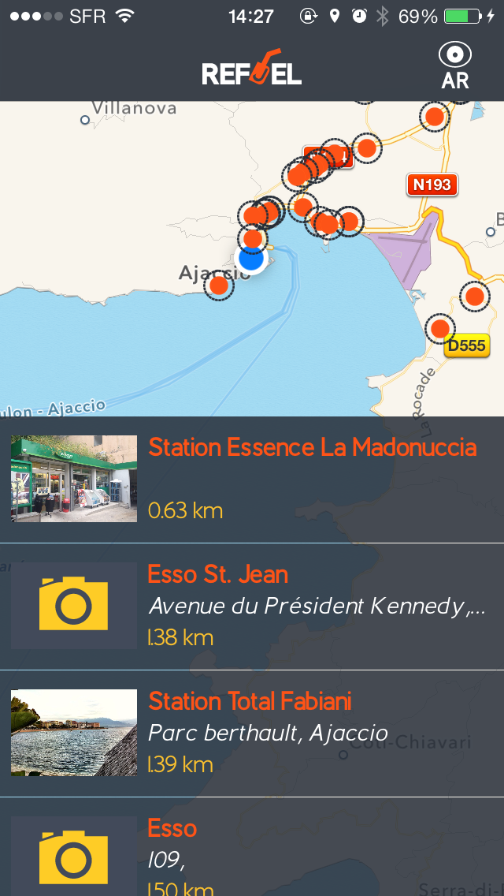
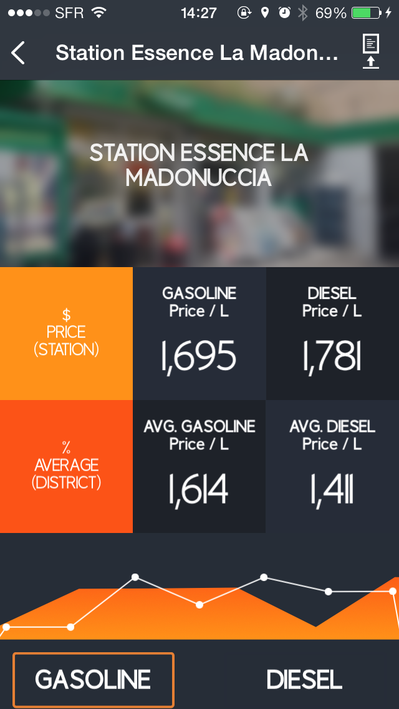
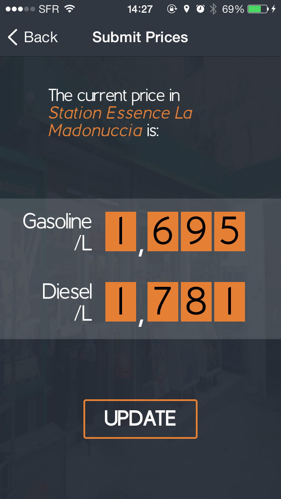

Application done for an hackathon...
GPL license for the morst part, some part are standalone libraries with other licenses compatible and some part will becme standalone libraries with other licenses.
For example a Library to made native graph will probably be published later and under BSD or MIT lincese, starting from MPGraphView

Developed by me and designed by @gubrs ( https://twitter.com/GuBrs )
