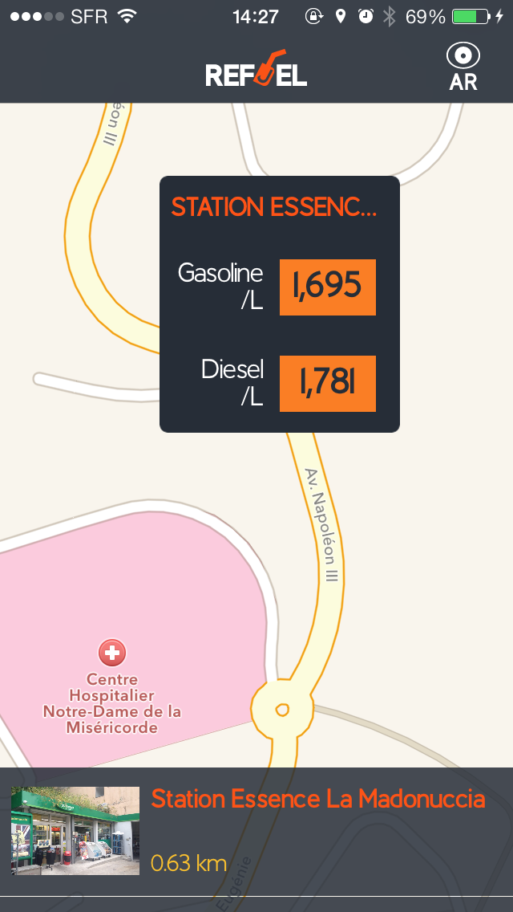

Application done for an hackathon ( http://hack4med.homerproject.eu )

GPL license for the morst part, but some part are/will-be standalone libraries with other licenses that are not restrictive like the GPL.

For example a Library to made native graph has been created starting from what I did for this Application during the hackathon
and it's now a really appreciated library under the BSD License  ( https://github.com/MP0w/MPPlot )

Developed by me and designed by @gubrs ( https://twitter.com/GuBrs )

